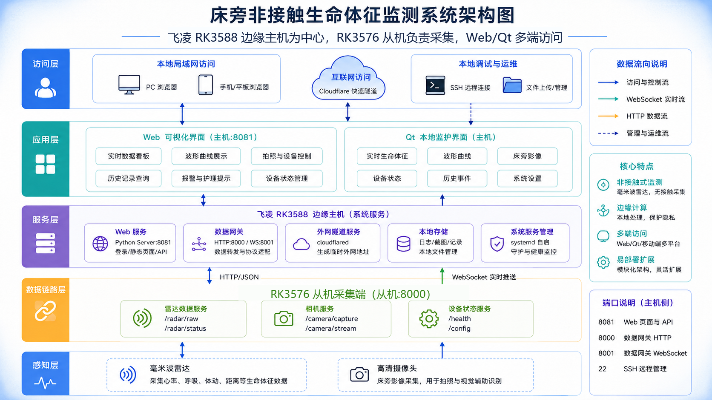

# Qiansai Health Monitor

基于飞凌 RK3588 与 RK3576 从机的非接触式健康监测系统。项目围绕毫米波雷达生命体征采集、床旁图像辅助判断、Qt 本地显示、Web 远程看护界面和 YOLOv8 床位状态识别展开，适用于嵌入式健康监测、养老看护、病床状态观察等场景的原型验证。

## 项目特点

- **非接触式生命体征监测**：通过 R60ABD1 毫米波雷达解析人体存在、心率、呼吸、体动、睡眠/在床状态等信息。
- **双端 UI 展示**：提供 RK 本地 Qt 界面与 Web 端仪表盘，支持实时数值、波形、床旁图像和设备调试信息展示。
- **RK3576 从机 + 飞凌 RK3588 双板协同**：RK3576 从机负责雷达/摄像头采集，飞凌 RK3588 负责网关聚合、本地 UI、Web 服务和外网访问。
- **摄像头缓存机制**：RK3576 从机可定时缓存最新床旁图像，飞凌 RK3588/Web 请求时优先读取缓存，降低实时拍照导致的等待和 502 错误。
- **YOLOv8 床位状态检测**：包含 `occupied_bed` 与 `empty_bed` 两类识别模型、训练配置、指标图和样例数据。
- **局域网与外网访问**：Web 端可通过局域网 IP 访问，也可配合 cloudflared/frp 暴露公网访问入口。

## 目录结构

```text
.
├── health_monitor/              # C/C++ 嵌入式 Web 服务与前端 UI 原型
├── qt_ui/                       # RK 本地 Qt/PySide6 界面
├── deployment/
│   ├── cat_lubancat/            # RK3576 从机雷达串口桥接与摄像头缓存服务
│   └── rk_web_ui/               # 飞凌 RK3588 Web 服务、网关、部署脚本和外网访问模板
├── yolo_bed_state/              # YOLOv8 床位占用状态检测模型与资料
├── docs/
│   ├── architecture.md          # 系统框图和数据流说明
│   ├── deployment.md            # 部署流程
│   ├── demo_video.md            # 演示视频说明
│   └── yolo_bed_state.md        # YOLO 模型说明
└── demo_video.mp4               # 演示视频，使用 Git LFS 管理
```

## 系统架构



核心链路：

```text
RK3576 从机采集雷达和摄像头
        ↓
飞凌 RK3588 网关统一读取数据和图像
        ↓
Qt UI 与 Web UI 共用飞凌 RK3588 网关数据
        ↓
浏览器通过局域网或外网访问 Web 端
```

更详细的框图见 [docs/architecture.md](docs/architecture.md)。

## 快速开始

### 1. RK3576 从机端

```bash
cd deployment/cat_lubancat
chmod +x start_radar_bridge.sh
./start_radar_bridge.sh
```

服务启动后默认提供：

```text
http://<SLAVE_IP>:8000/radar/raw
http://<SLAVE_IP>:8000/camera/latest.jpg
http://<SLAVE_IP>:8000/camera/capture
```

其中 `/camera/capture` 会优先返回 RK3576 从机本机缓存的最新 JPEG 图片。

### 2. 飞凌 RK3588 Web 端

```bash
cd deployment/rk_web_ui
cp rk_stack.env.example rk_stack.env
```

编辑 `rk_stack.env`，至少设置：

```text
WEB_USER=admin
WEB_PASS=change-this-password
LUBANCAT_HOST=auto
```

启动：

```bash
chmod +x start_rk_stack.sh
./start_rk_stack.sh
```

浏览器访问：

```text
http://<RK_IP>:8081
```

### 3. Qt 本地界面

```bash
cd qt_ui
python3 -m pip install -r requirements.txt
python3 main.py
```

Qt 端可通过 `RADAR_REMOTE_URL` 指向 RK 网关数据接口，例如：

```bash
RADAR_REMOTE_URL=http://127.0.0.1:8000/radar/raw python3 main.py
```

## YOLOv8 床位状态检测

YOLO 资料在 [yolo_bed_state](yolo_bed_state)：

- `model/best.pt`：最佳权重。
- `model/last.pt`：最后一轮权重。
- `config/data.yaml`：两类检测配置。
- `metrics/`：训练曲线、混淆矩阵、PR/F1/P/R 曲线。
- `predict_results/`：验证批次预测效果图。
- `sample_train/`、`sample_val/`：少量训练/验证样例。
- `test_images_unlabeled/`：无标签图片，可用于演示预测。

类别定义：

```text
0 = occupied_bed
1 = empty_bed
```

训练指标最后一轮大致为：

```text
precision: 0.9358
recall: 0.9003
mAP50: 0.9370
mAP50-95: 0.6201
```

详见 [docs/yolo_bed_state.md](docs/yolo_bed_state.md)。

## 演示视频

仓库包含 `demo_video.mp4`，使用 Git LFS 管理。克隆后如果视频文件不是完整文件，请先安装 Git LFS：

```bash
git lfs install
git lfs pull
```

视频说明见 [docs/demo_video.md](docs/demo_video.md)。

## 安全说明

公开仓库不包含真实账号密码、临时外网地址或现场固定 IP。部署时请自行复制 `.example` 配置文件并修改：

```text
deployment/rk_web_ui/rk_stack.env.example
deployment/rk_web_ui/rk_web_ui.env.example
```

外网访问时务必设置强密码，不要将空密码 Web 服务暴露到公网。

## License

本项目以 MIT License 开源，详见 [LICENSE](LICENSE)。
