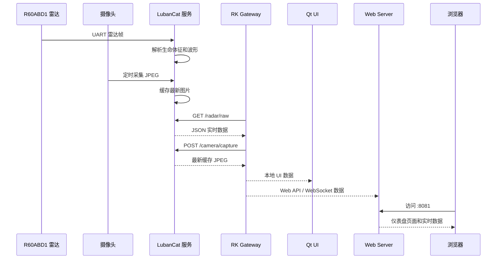

# 系统架构说明

本项目采用 LubanCat + RK 双板结构。LubanCat 靠近传感器，负责雷达串口数据解析和摄像头图像缓存；RK 作为本地显示、Web 服务、数据聚合和外网访问中心。

## 设备角色

| 设备 | 主要职责 |
|---|---|
| R60ABD1 毫米波雷达 | 输出人体存在、心率、呼吸、体动、睡眠和在床状态相关帧 |
| LubanCat | 读取雷达串口，缓存摄像头图片，提供 HTTP 数据接口 |
| RK 板 | 运行网关、Qt UI、Web Server、外网隧道 |
| 浏览器终端 | 访问 Web Dashboard，查看数据和图像 |

## 数据流

## 网络端口

| 位置 | 默认端口 | 说明 |
|---|---:|---|
| LubanCat HTTP | 8000 | `/radar/raw`、`/camera/latest.jpg`、`/camera/capture` |
| RK Gateway HTTP | 8000 | 给 Qt/Web 提供统一数据入口 |
| RK Gateway WebSocket | 8001 | 给 Web 端代理实时消息 |
| RK Web Server | 8081 | Web Dashboard 和登录页面 |

## 图像链路优化

早期实时拍照链路容易出现等待时间长、502 Bad Gateway 等问题。当前设计将缓存前移到 LubanCat：

1. LubanCat 后台低频拍照。
2. 图片压缩为适合网络传输的 JPEG。
3. RK 请求时直接读取最新缓存图。
4. Web 页面不再阻塞等待实时采集。

该策略可以减少相机启动、曝光、编码和网络传输带来的页面卡顿。

